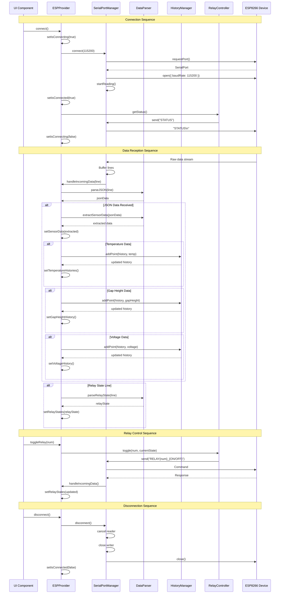
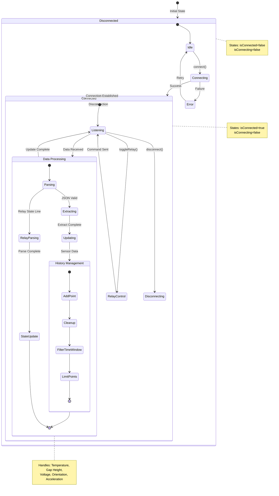
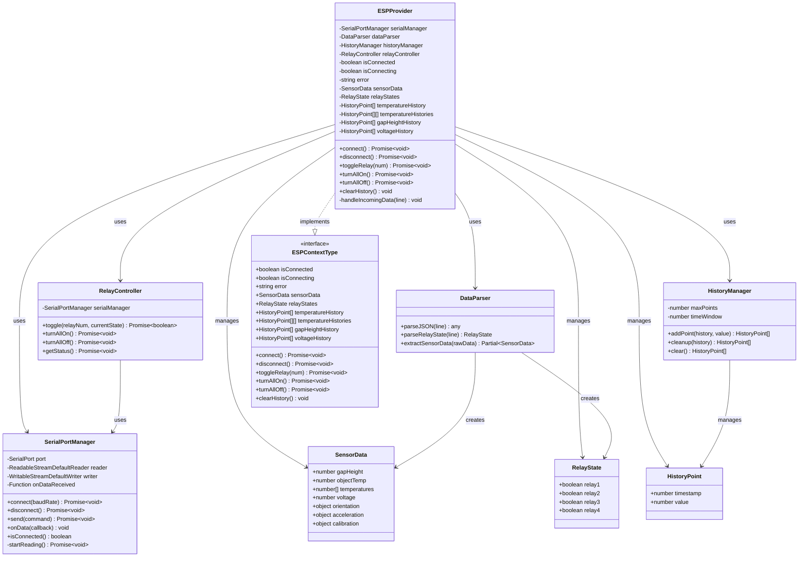
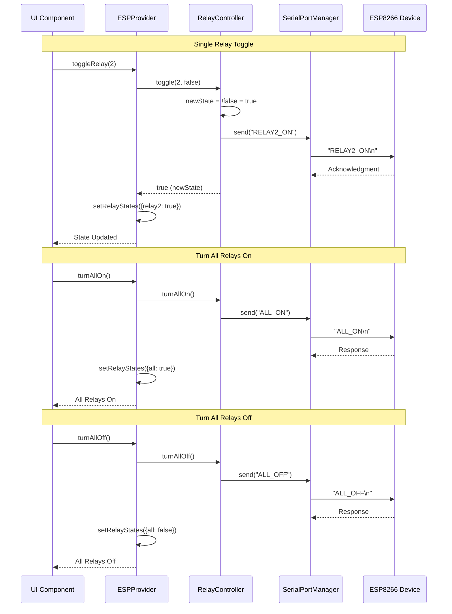
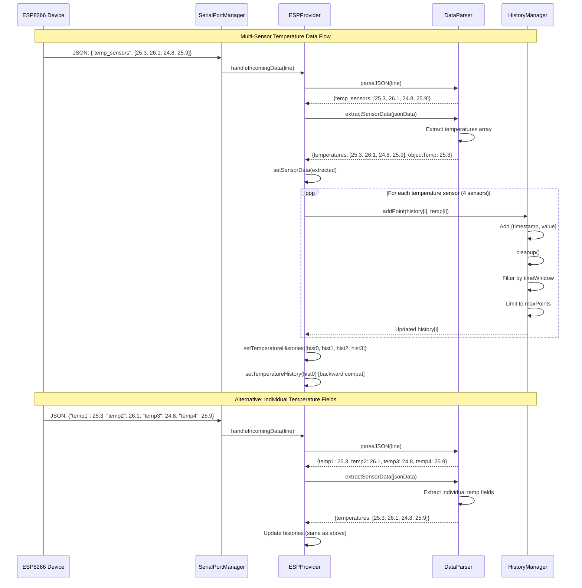

# ESPContext System Diagrams

This document contains sequence, state, and class diagrams for the ESPContext system.

## 1. Sequence Diagram - Connection and Data Flow

## 2. State Diagram - System States

## 3. Class Diagram - System Architecture

## 4. Sequence Diagram - Relay Control Flow

## 5. Sequence Diagram - Temperature Data Processing

## Diagram Notes

### Sequence Diagrams
- Show the interaction flow between components
- Demonstrate async operations and callbacks
- Illustrate data transformation pipeline

### State Diagram
- Represents system lifecycle states
- Shows transitions between connection states
- Includes nested states for data processing

### Class Diagram
- Shows class structure and relationships
- Displays dependencies and associations
- Illustrates data flow through the system

### Key Components
1. **ESPProvider**: Main React context provider managing all state
2. **SerialPortManager**: Handles Web Serial API communication
3. **DataParser**: Parses incoming JSON and relay state data
4. **HistoryManager**: Manages time-series data with cleanup
5. **RelayController**: Controls relay operations via serial commands

