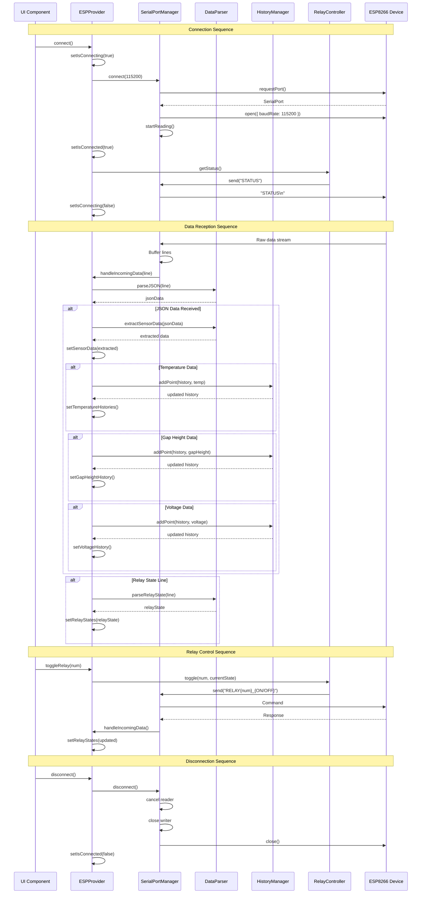
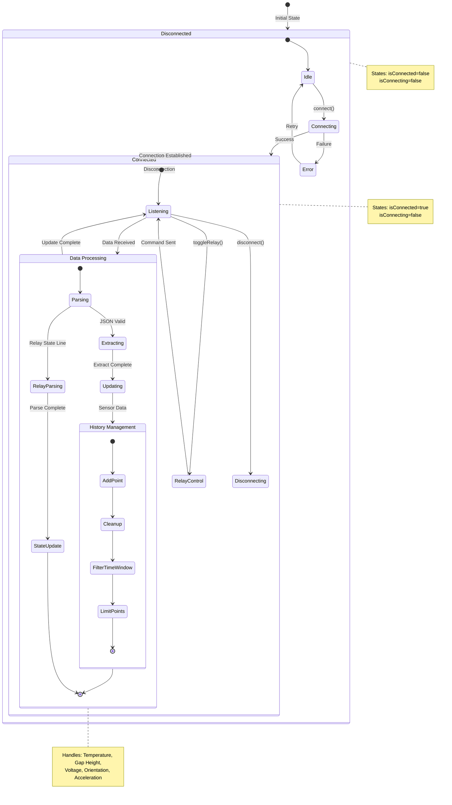
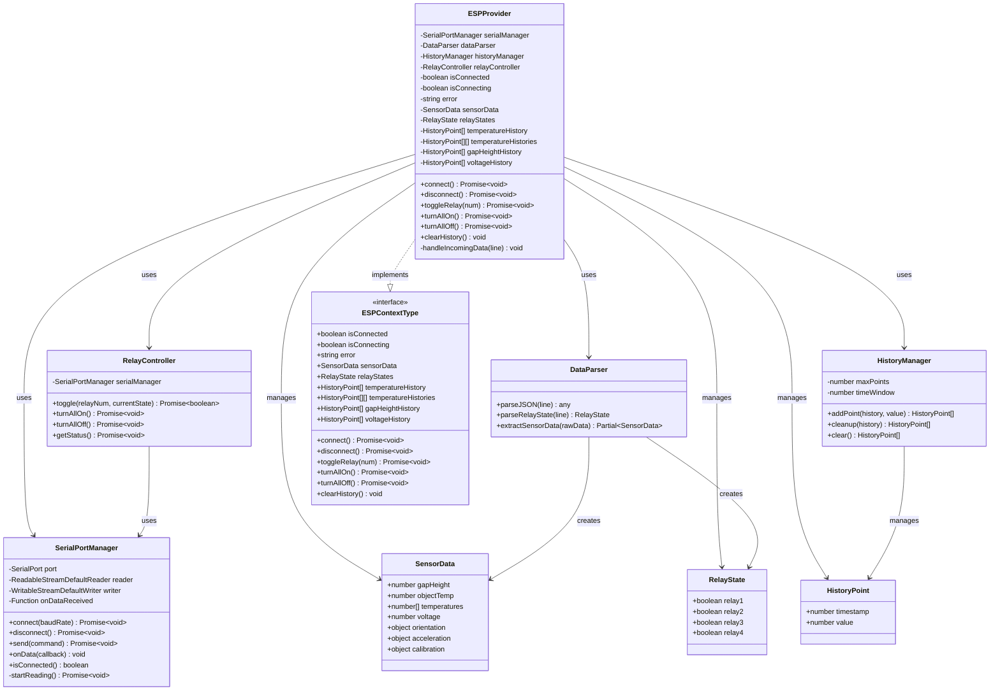
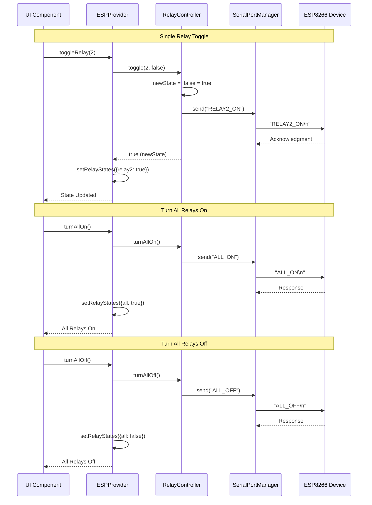
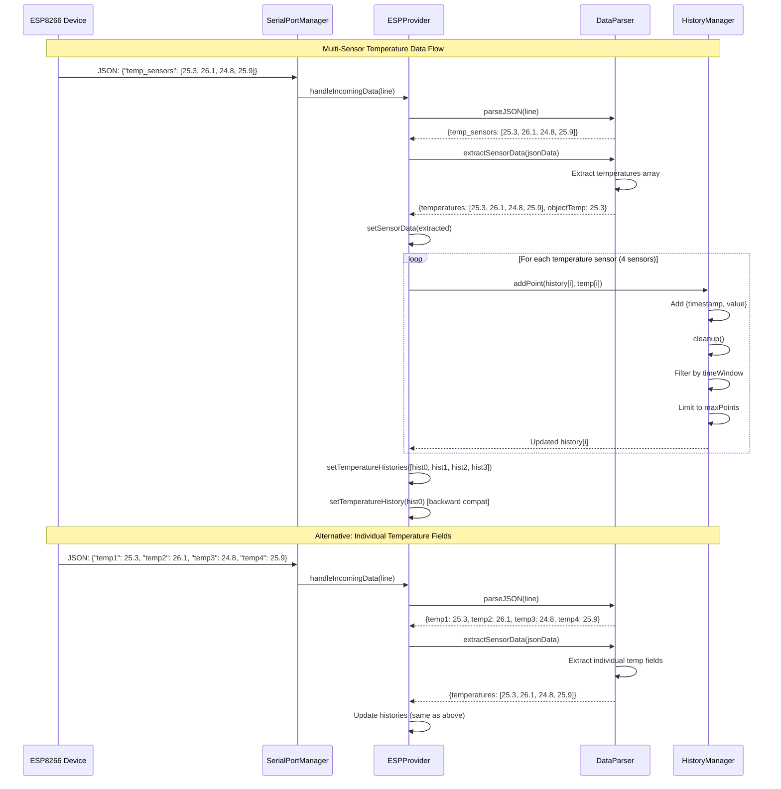

# LoopMIT - Hyperloop Pod Control Dashboard

This repository contains the code for the **LoopMIT Hyperloop Pod Control Dashboard**, a sophisticated interface designed to monitor and control the Hyperloop pod's subsystems in real-time. It provides critical data visualization, hardware control, and safety monitoring capabilities.

## Key Features

*   **Real-Time Sensor Monitoring**: Instant visualization of critical telemetry including:
    *   **Temperature**: Multi-point thermal monitoring of pod systems.
    *   **Gap Height**: Precise levitation gap measurements via LIDAR.
    *   **Voltage**: Battery and power system voltage levels.
    *   **IMU Data**: Orientation (Pitch, Roll, Yaw) and Acceleration monitoring.
*   **Relay Control System**: Direct manual and automated control of on-board electrical relays to manage power distribution to subsystems.
*   **3D Visualization**: Interactive 3D representation of the pod's orientation and state using `react-three-fiber`.
*   **Safety & Error Logging**: robust error detection system with bitmask-based failure identification and historical logging.
*   **Hardware Integration**: Seamless communication with the ESP8266 microcontroller via the **Web Serial API**, eliminating the need for intermediate backend servers.
*   **Secure Access**: Role-based authentication and user management powered by **Clerk**.

## Technical Stack

*   **Frontend**: React, Vite, Tailwind CSS
*   **3D Graphics**: React Three Fiber
*   **Hardware Communication**: Web Serial API
*   **Authentication**: Clerk
*   **State Management**: React Context API (`ESPContext`)

---

## Error Logging System

The system implements a robust error detection mechanism based on a binary bitmask `emergency_reason_mask`. This allows efficient transmission of multiple error states simultaneously from the hardware to the dashboard.

### How it Works

1.  **Bitmask Transmission**: The ESP8266 sends a single integer (`emergency_reason_mask`) where each bit represents a specific error condition.
2.  **Decoding**: The dashboard performs a bitwise AND operation (e.g., `mask & (1 << n)`) to check which specific errors are active.
3.  **Logging**: Detected errors are logged to the `ErrorLog` state with timestamps and severity levels, which are then displayed in the UI's error history panel.

### Error Codes Mapping

The following table details the error bitmask mapping:

| Bit Index | Hex Value | Decimal | Error Description | Severity |
| :--- | :--- | :--- | :--- | :--- |
| 0 | `0x0001` | 1 | **IMU Sensor Failure** | Error |
| 1 | `0x0002` | 2 | **LIDAR 1 Sensor Failure** | Error |
| 2 | `0x0004` | 4 | **LIDAR 2 Sensor Failure** | Error |
| 3 | `0x0008` | 8 | **Voltage Sensor 1 Failure** | Error |
| 4 | `0x0010` | 16 | **Voltage Sensor 2 Failure** | Error |
| 5 | `0x0020` | 32 | **Voltage Sensor 3 Failure** | Error |
| 6 | `0x0040` | 64 | **Temperature Sensor 1 Failure** | Error |
| 7 | `0x0080` | 128 | **Temperature Sensor 2 Failure** | Error |
| 8 | `0x0100` | 256 | **Temperature Sensor 3 Failure** | Error |
| 9 | `0x0200` | 512 | **Pressure Sensor Failure** | Error |
| 10 | `0x0400` | 1024 | **Orientation Out of Range** | Warning |
| 11 | `0x0800` | 2048 | **Acceleration Limit Exceeded** | Warning |
| 12 | `0x1000` | 4096 | **LIDAR Gap Warning** | Warning |
| 13 | `0x2000` | 8192 | **Manual Emergency Stop** | Error |

---

## System Diagrams

### 1. Sequence Diagram - Connection and Data Flow

This diagram illustrates how the dashboard connects to the hardware and processes incoming telemetry.



### 2. State Diagram - System States

Shows the lifecycle states of the application, from disconnected to active monitoring.



### 3. Class Diagram - System Architecture

Visualizes the relationship between the key classes: `ESPProvider`, `SerialPortManager`, `DataParser`, and others.



### 4. Sequence Diagram - Relay Control Flow

Details the request-response cycle when a relay is toggled.



### 5. Sequence Diagram - Temperature Data Processing

Shows how multi-sensor temperature data is parsed and stored in history.



## Running the Code

1.  **Install Dependencies**:
    ```bash
    npm i
    ```
2.  **Start Development Server**:
    ```bash
    npm run dev
    ```

---
**Note**: This README is auto-generated for project presentation purposes.